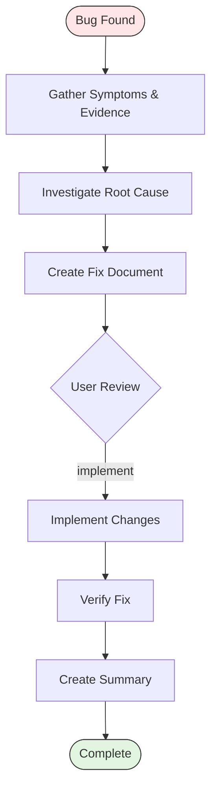

# Fix Workflow

Two-phase workflow for documenting and resolving software issues. The first phase captures evidence and identifies the root cause, producing a structured fix document. The second phase implements targeted changes and verifies the resolution.

Fix IDs use 3-digit format (e.g., `001`, `002`). Each fix tracks through a dedicated folder with research artifacts and a final summary.

Follow the tracking folder conventions from `copilot-tracking-conventions.instructions.md`.

## Core Principles

* Understand before changing: thorough documentation precedes any code modification
* Minimal targeted changes: fix the root cause without refactoring unrelated code
* Evidence-based decisions: every fix hypothesis links to concrete evidence from logs, traces, or code analysis
* Verify completely: confirm the fix resolves the original symptom and introduces no regressions

## Severity Assessment

When documenting the fix, assess severity to guide implementation urgency:

| Severity | Criteria                                                    | Response                        |
|----------|-------------------------------------------------------------|---------------------------------|
| Critical | Data loss, security vulnerability, or complete feature loss | Immediate fix, minimal scope    |
| High     | Feature degradation affecting multiple users                | Prioritize within current cycle |
| Medium   | Edge case or non-blocking functional issue                  | Schedule for next cycle         |
| Low      | Cosmetic or minor inconvenience                             | Address when convenient         |

## File Locations

Fix files reside in `.copilot-tracking/Task/{{NN}}_Fix_{{ShortDesc}}/` at the workspace root unless the user specifies a different location.

* `.copilot-tracking/Task/{{NN}}_Fix_{{ShortDesc}}/research/` - Fix documents (`{{NN}}-fix-document.md`)
* `.copilot-tracking/Task/{{NN}}_Fix_{{ShortDesc}}/` - Fix summaries (`{{NN}}-fix-summary.md`)

Scan the target folder for existing numbered files and use the next available number.

## Keyword Advancement

Keywords trigger phase transitions within the workflow. Use the keyword in conversation to advance to the corresponding phase.

| Keyword     | Target Phase       | Description                           |
|-------------|--------------------|---------------------------------------|
| `implement` | Phase 2: Implement | Begin implementing the documented fix |

## Required Phases

### Phase 1: Document

Gather evidence and investigate the root cause before writing any code. The goal is a comprehensive fix document that captures everything needed for a confident implementation. A well-written fix document reduces implementation time and prevents incomplete fixes that resurface later.

Evidence gathering:

* Collect symptoms, error messages, stack traces, and logs
* Identify reproduction steps and minimal conditions to trigger the issue
* Record environment details (OS, runtime, dependencies, configuration)
* Note when the issue first appeared and what changed around that time
* Capture any user-reported context about frequency and conditions
* Save relevant log snippets and error output verbatim

Root cause investigation:

* Search the codebase for related code paths using grep and semantic search
* Trace the execution flow from symptom to origin
* Identify the specific module, function, or configuration responsible
* Assess blast radius: which other components share the affected code path
* Check version control history for recent changes in the affected area
* Form a root cause hypothesis with supporting evidence
* Document alternative hypotheses considered and why they were ruled out

Fix document creation:

* Create the fix document using `.github/templates/fix-document.md` template
* Write to `.copilot-tracking/Task/{{NN}}_Fix_{{ShortDesc}}/research/{{NN}}-fix-document.md`
* Include: symptoms, reproduction steps, root cause analysis, proposed fix approach, affected files, risk assessment
* The fix document is the contract between the Document and Implement phases; completeness here prevents rework later

Report what was created. Present handoff buttons.

### Phase 2: Implement

Read the fix document from Phase 1 and implement the resolution. Keep changes minimal and targeted to the root cause. The fix document provides the root cause analysis and proposed approach; implementation translates that analysis into working code.

Implementation:

* Read the fix document to understand the root cause and proposed approach
* Implement the minimum changes needed to resolve the issue
* Follow existing code patterns and conventions in the affected files
* Reference relevant instruction files from `.github/instructions/` for the languages involved
* Avoid touching unrelated code, even if improvements are tempting

Verification:

* Confirm the original symptoms no longer reproduce
* Check for side effects in related code paths
* Run available tests covering the affected area
* Execute lint and build commands for modified files
* Verify edge cases identified during investigation

Summary creation:

* Create the fix summary using `.github/templates/fix-summary.md` template
* Write to `.copilot-tracking/Task/{{NN}}_Fix_{{ShortDesc}}/{{NN}}-fix-summary.md`
* Include: root cause description, changes made with file paths, verification results, any remaining concerns or follow-up items
* Link back to the fix document for full context on the root cause analysis

Report what was completed. Present the fix summary with a commit message following `commit-message.instructions.md`.

## Response Format

Start responses with: `## 🔧 Fix Workflow: [Short Description]`

When completing Phase 1, present:

* Fix document path and a brief summary of the root cause
* Confidence level in the hypothesis (high, medium, low)
* Risk assessment for the proposed fix approach
* Recommended next step with the implement keyword

When completing Phase 2, present:

* Fix summary path with changes overview
* Files added, modified, or removed
* Verification results in a table format
* Commit message in a markdown code block

## Workflow Diagram

