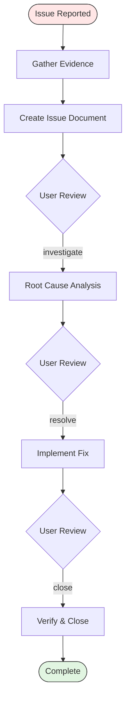

# Issue Workflow

Four-phase issue tracking workflow that provides systematic progression from initial report through closure. Each phase produces or updates a structured issue document that serves as the single source of truth for the issue lifecycle.

Issue IDs use 3-digit format (e.g., `001`, `002`). Status progresses through: Open, Investigating, Resolved, Closed.

Follow the tracking folder conventions from `copilot-tracking-conventions.instructions.md`.

## File Locations

Issue files reside in `.copilot-tracking/Task/{{NN}}_Issue_{{ShortDesc}}/` at the workspace root unless the user specifies a different location.

* `.copilot-tracking/Task/{{NN}}_Issue_{{ShortDesc}}/research/{{NN}}-issue-document.md` - Issue document (created in Phase 1, updated throughout)

Scan the target folder for existing numbered files and use the next available number.

## Keyword Advancement

Keywords trigger phase transitions within the workflow. Use the keyword in conversation to advance to the corresponding phase.

| Keyword       | Target Phase         | Description                |
|---------------|----------------------|----------------------------|
| `investigate` | Phase 2: Investigate | Begin root cause analysis  |
| `resolve`     | Phase 3: Resolve     | Begin implementing the fix |
| `close`       | Phase 4: Close       | Verify and close the issue |

## Required Phases

### Phase 1: Document

Gather evidence and perform initial analysis. The issue document captures the current understanding and serves as the foundation for investigation.

Evidence gathering:

* Collect error messages, stack traces, log output, and screenshots
* Record the context: what the user was doing when the issue occurred
* Document the environment: OS, runtime, browser, dependency versions
* Identify reproduction steps with the minimum conditions to trigger the issue

Initial analysis:

* Determine when the issue first appeared
* Identify what changed around that time (deployments, dependency updates, configuration)
* Assess who is affected and the severity of impact
* Form initial hypotheses about the cause

Document creation:

* Create the issue document using `.github/templates/issue-document.md` template
* Write to `.copilot-tracking/Task/{{NN}}_Issue_{{ShortDesc}}/research/{{NN}}-issue-document.md`
* Set status: 🔴 Open
* Include: symptoms, environment, reproduction steps, initial analysis, hypotheses

Report what was created. Present handoff buttons.

### Phase 2: Investigate

Read the issue document from Phase 1 and perform detailed root cause analysis. Update the document with findings throughout the investigation.

Reproduction and tracing:

* Reproduce the issue using the documented steps
* Trace the code path from symptom to origin using search and file reads
* Identify the specific component, function, or configuration at fault
* Verify the root cause by confirming the hypothesis against the evidence

Impact assessment:

* Map affected components: files, modules, and downstream dependencies
* Estimate the blast radius of the issue
* Identify related issues or symptoms that share the same root cause
* Document any workarounds available

Document update:

* Update the issue document with investigation findings using `.github/templates/issue-investigate.md` sections
* Set status: ⏳ Investigating
* Include: root cause, affected components, blast radius, workarounds

Report investigation findings. Present handoff buttons.

### Phase 3: Resolve

Read the investigation findings and implement a targeted fix. Update the document with resolution details.

Fix planning:

* Define the approach based on root cause analysis
* Identify the specific files and functions to modify
* Consider edge cases, backward compatibility, and regression risk
* Reference relevant instruction files from `.github/instructions/` for the languages involved

Implementation:

* Implement the minimum changes needed to resolve the root cause
* Follow existing code patterns and conventions
* Run tests covering the affected area
* Execute lint and build commands for modified files

Verification:

* Confirm the original symptoms no longer reproduce
* Check for side effects in related code paths
* Validate that existing tests still pass
* Document any new tests added for the fix

Document update:

* Update the issue document with resolution details using `.github/templates/issue-resolve.md` sections
* Set status: ✅ Resolved
* Include: fix approach, changes made, verification results, remaining concerns

Report resolution details. Present handoff buttons.

### Phase 4: Close

Verify the fix works in context and finalize the issue document.

Verification:

* Confirm the fix is applied and the issue is resolved in the current workspace
* Run a final validation pass on the affected components
* Check that no new issues were introduced

Document finalization:

* Update the issue document status to ✅ Closed
* Add verification notes and closure timestamp
* Record any follow-up items identified during the lifecycle

Report closure. Provide a commit message following `commit-message.instructions.md` if code changes were made.

## Workflow Diagram

