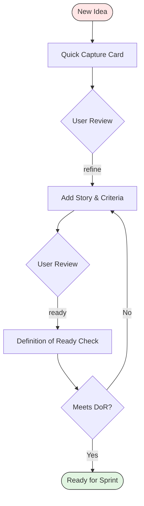

# Backlog Workflow

Three-phase backlog workflow based on the 3Cs pattern: Card, Conversation, Confirmation. Each phase progressively enriches a backlog item from a raw idea into a sprint-ready work item with clear acceptance criteria and estimation.

Backlog IDs use 3-digit format (e.g., `001`, `002`). Status progresses through: Captured, Refined, Ready.

Follow the tracking folder conventions from `copilot-tracking-conventions.instructions.md`.

## File Locations

Backlog files reside in `.copilot-tracking/Task/{{NN}}_Backlog_{{ItemName}}/` at the workspace root unless the user specifies a different location.

* `.copilot-tracking/Task/{{NN}}_Backlog_{{ItemName}}/research/{{NN}}-backlog-capture.md` - Capture card (created in Phase 1, updated throughout)

Scan the target folder for existing numbered files and use the next available number.

## Keyword Advancement

Keywords trigger phase transitions within the workflow. Use the keyword in conversation to advance to the corresponding phase.

| Keyword  | Target Phase    | Description                                  |
|----------|-----------------|----------------------------------------------|
| `refine` | Phase 2: Refine | Begin adding story, criteria, and estimation |
| `ready`  | Phase 3: Ready  | Run Definition of Ready checklist            |

## Required Phases

### Phase 1: Capture (the Card)

Quick capture prioritizes speed over completeness. The card is a reminder for future conversation, not a specification.

Capture elements:

* Title: concise, action-oriented description
* Summary: one sentence explaining the value or need
* Type: feature, bug, chore, spike, or technical debt
* Value signal: who benefits and why this matters
* Source: where the idea originated (user request, incident, observation, dependency)

Principles:

* Speed over completeness: capture the essence in minutes
* Raw notes are acceptable; polished prose comes later
* The card serves as a reminder, not a requirements document
* Include enough context that the item makes sense when revisited weeks later

Document creation:

* Create the capture card using `.github/templates/backlog-capture.md` template
* Write to `.copilot-tracking/Task/{{NN}}_Backlog_{{ItemName}}/research/{{NN}}-backlog-capture.md`
* Set status: 📋 Captured

Report what was captured. Present handoff buttons.

### Phase 2: Refine (the Conversation)

Read the capture card from Phase 1 and enrich it with structured requirements. This phase transforms a raw idea into a well-defined backlog item through analysis and conversation.

User story:

* Write in standard format: "As a {{user_role}}, I want {{goal}} so that {{value}}"
* Keep the story focused on a single user need
* Ensure the value statement articulates a real benefit

Acceptance criteria:

* Write in Given/When/Then format or as a checklist
* Cover the happy path, edge cases, and error conditions
* Include measurable outcomes where possible
* Ensure each criterion is independently testable

INVEST validation:

* Independent: can be developed without depending on other items
* Negotiable: implementation details are flexible
* Valuable: delivers clear value to a user or stakeholder
* Estimable: team can estimate the effort with reasonable confidence
* Small: completable within a single sprint
* Testable: acceptance criteria are verifiable

Estimation and priority:

* Apply MoSCoW prioritization (Must have, Should have, Could have, Won't have)
* Estimate using T-shirt sizing (XS, S, M, L, XL) or Story Points
* Identify dependencies on other items, teams, or external factors

Document update:

* Update the capture card with refined content
* Set status: 📝 Refined

Report refinement results. Present handoff buttons.

### Phase 3: Ready (the Confirmation)

Run the Definition of Ready checklist against the refined backlog item. This phase confirms the item is prepared for sprint planning.

Definition of Ready checklist:

* Clear user story that articulates who, what, and why
* Acceptance criteria that are specific and testable
* Estimation completed (T-shirt size or Story Points assigned)
* Dependencies identified and either resolved or tracked
* Small enough to complete within a single sprint
* No blocking questions remain unanswered
* Technical approach understood at a sufficient level

Status determination:

* ✅ Ready for Sprint: all checklist items pass
* 📋 Needs Specification: missing or incomplete criteria identified (return to Phase 2)
* ⏸️ Deferred: blocked by external dependency or deliberate postponement
* ❌ Closed: no longer relevant or superseded by another item

Document update:

* Update the capture card with Definition of Ready results
* Set final status based on the checklist outcome

Report the readiness assessment with the checklist results. When the item is ready, provide a summary suitable for sprint planning. When the item needs more work, identify the specific gaps and recommend returning to the Refine phase.

## Workflow Diagram

