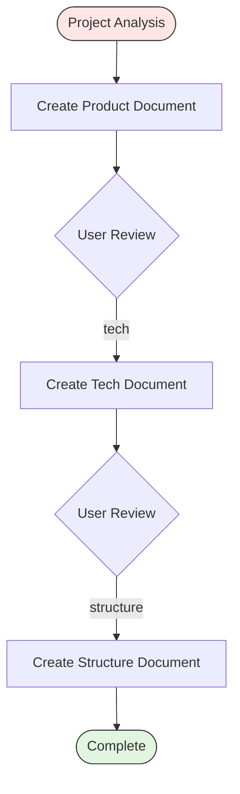

# Steering Workflow

Three-phase workflow for creating project-level guidance documents. Each phase produces a standalone steering document that captures product vision, technology decisions, and codebase structure for an established project.

Only start this workflow when explicitly requested. Steering documents are high-level artifacts intended for projects with existing codebases that need formalized documentation of their direction and architecture.

Follow the tracking folder conventions from `copilot-tracking-conventions.instructions.md`.

## Core Principles

* Observer mindset: document what exists rather than prescribing what should change
* Evidence from artifacts: derive conclusions from configuration files, code patterns, and project structure rather than assumptions
* Incremental depth: each phase builds on the previous document, adding a new analytical lens
* Actionable output: steering documents inform future decisions, onboarding, and architecture reviews

## File Locations

Steering files reside in `.copilot-tracking/Task/{{NN}}_Steering_{{ProjectName}}/` at the workspace root unless the user specifies a different location.

* `.copilot-tracking/Task/{{NN}}_Steering_{{ProjectName}}/research/{{NN}}-product.md` - Product document
* `.copilot-tracking/Task/{{NN}}_Steering_{{ProjectName}}/research/{{NN}}-tech.md` - Tech document
* `.copilot-tracking/Task/{{NN}}_Steering_{{ProjectName}}/research/{{NN}}-structure.md` - Structure document

Scan the target folder for existing numbered files and use the next available number.

## Keyword Advancement

Keywords trigger phase transitions within the workflow. Use the keyword in conversation to advance to the corresponding phase.

| Keyword     | Target Phase       | Description                       |
|-------------|--------------------|-----------------------------------|
| `tech`      | Phase 2: Tech      | Begin technology stack analysis   |
| `structure` | Phase 3: Structure | Begin codebase structure analysis |

## Required Phases

### Phase 1: Product Document

Analyze the project from a product perspective. The product document captures what the project does, who it serves, and what success looks like.

Analysis areas:

* Project purpose and the problem it solves
* Target users and their primary workflows
* Key features and capabilities
* Business objectives and value proposition
* Success metrics and how they are measured
* Current state: maturity, adoption, known limitations

Source investigation:

* Read README, CONTRIBUTING, and any existing product documentation
* Scan issue trackers and roadmaps for feature priorities
* Check for user-facing configuration or feature flags
* Review recent changes for active development areas

Document creation:

* Create the product document using `.github/templates/steering-product.md` template
* Write to `.copilot-tracking/Task/{{NN}}_Steering_{{ProjectName}}/research/{{NN}}-product.md`
* Include: project purpose, target users, feature inventory, business objectives, success metrics, current state assessment
* Focus on observable facts over aspirational statements; what the project does today takes precedence over what it could become

Report what was created. Present handoff buttons.

### Phase 2: Tech Document

Read the product document from Phase 1 for context, then analyze the technology stack. The tech document captures how the project is built and what technical decisions shape its architecture. Cross-reference the product document to connect technology choices to the features and workflows they enable.

Technology stack analysis:

* Check configuration files: `package.json`, `*.csproj`, `requirements.txt`, `Cargo.toml`, `go.mod`, `Gemfile`, and similar manifests
* Identify core languages, frameworks, and runtime environments
* Map architecture patterns: monolith, microservices, serverless, plugin-based
* Document data storage: databases, caches, file-based storage, state management

Infrastructure and integration:

* Identify external service integrations and APIs consumed
* Document CI/CD pipelines and deployment targets
* Review dev environment setup: containers, scripts, configuration
* Note security patterns: authentication, authorization, secrets management
* Catalog build tools, bundlers, and package managers in use

Document creation:

* Create the tech document using `.github/templates/steering-tech.md` template
* Write to `.copilot-tracking/Task/{{NN}}_Steering_{{ProjectName}}/research/{{NN}}-tech.md`
* Include: project type, core technologies, architecture overview, data storage, integrations, dev environment, deployment, security patterns

Report what was created. Present handoff buttons.

### Phase 3: Structure Document

Read the product and tech documents for context, then analyze the codebase organization. The structure document captures how code is organized and what patterns govern the project layout. This phase connects the technical architecture from Phase 2 to the physical file and directory organization.

Codebase analysis:

* Map the directory tree and identify organizational principles
* Document naming conventions for files, directories, and modules
* Identify module boundaries and dependency flow between components
* Catalog shared utilities, common patterns, and cross-cutting concerns

Pattern discovery:

* Search for architectural patterns: layered, domain-driven, feature-based, or hybrid
* Document configuration file locations and their roles
* Map test organization relative to source code
* Identify generated or build-output directories
* Note any deviations from the dominant organizational pattern

Document creation:

* Create the structure document using `.github/templates/steering-structure.md` template
* Write to `.copilot-tracking/Task/{{NN}}_Steering_{{ProjectName}}/research/{{NN}}-structure.md`
* Include: directory organization, naming conventions, module boundaries, code patterns, configuration layout, test structure, build outputs
* Highlight any inconsistencies or deviations from the dominant pattern, as these often indicate areas of organic growth or technical debt

Report what was created. Provide a summary of all three steering documents with their paths and a brief description of each document's scope.

## Response Format

Start responses with: `## 🧭 Steering Workflow: [Project Name]`

When completing each phase, present:

* Document path and a one-sentence scope summary
* Key findings (3-5 bullet points highlighting the most significant observations)
* Recommended next step with the appropriate keyword

When completing the final phase, present a consolidated summary table listing all three documents with their paths and scope.

## Workflow Diagram

